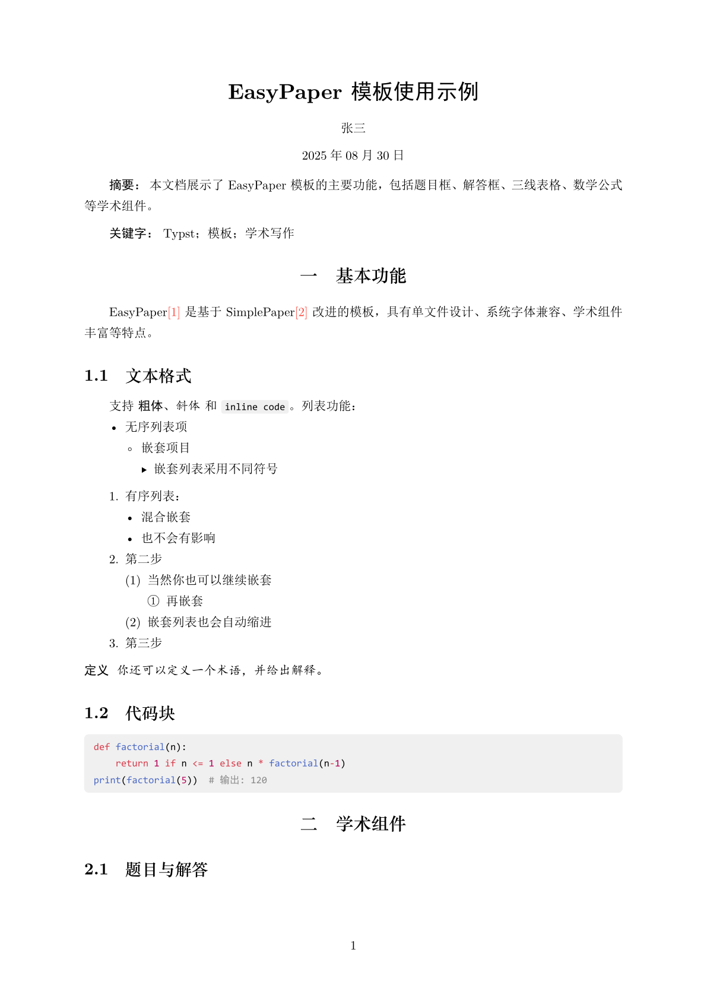
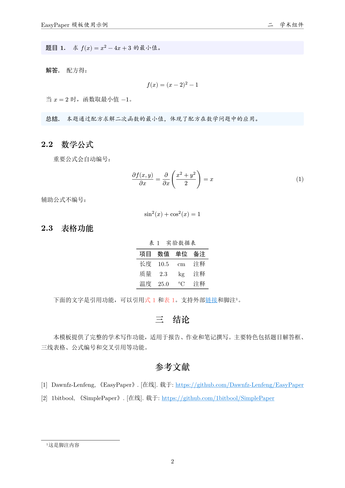

# easy-paper

[](https://typst.app/universe/package/easy-paper)


A ready-to-use Typst template for Chinese papers.

一个基于 [SimplePaper](https://github.com/jinhao-huang/SimplePaper) 改进的 Typst 模板，可用于日常报告/作业等。只需一个文件，无需外置库，使用 Windows 系统内置字体，即可开始创作。


## 快速开始

```typst
#import "@preview/easy-paper:0.2.0": *

#show: project.with(
  title: "文档标题",
  author: "作者姓名",
  date: auto,
  abstract: [
    摘要内容...
  ],
  keywords: ("关键词1", "关键词2")
)
```

或者直接使用 Typst-CLI 初始化：
```bash
typst init @preview/easy-paper
```

### 学术组件

在原有模板的基础上，一共有以下学术组件，以供基本日常笔记使用。

**题目框：**
```typst
#problem[
  计算 $f(x) = x^2$ 的导数。
]
```

**解答框：**
```typst
#solution[
  $f'(x) = 2x$
]
```

**总结框：**
```typst
#summary[
  这里可以写总结性的内容。
]
```

**三线表格：**
```typst
// 默认启用三线表格式
#figure(
  table(
      columns: 3,
      [项目], [数值], [单位],
      [长度], [10], [cm],
      [质量], [5], [kg],
  ),
  caption: [测量数据]
)
```

### 数学公式

模板对数学公式编号进行了优化，带标签的公式会自动编号，不带标签的公式不会编号。

```typst
// 行内公式
这是 $E = mc^2$ 公式。

// 带编号的公式
$ x = frac(-b plus.minus sqrt(b^2 - 4ac), 2a) $ <eq:quadratic>

// 不编号的公式
$ sum_(i=1)^n i = frac(n(n+1), 2) $
```

同时有一些自定义函数，如偏微分（后续可能会添加更多）：

```typst
// 偏微分
$ frac(partial f, partial x) = pardiff(f, x) $
```

### 字体说明

目前默认字体为：

- 中文：SimSun, STZhongsong, KaiTi, SimHei
- 英文：New Computer Modern, Times New Roman, Consolas

Windows 大部分字体已内置，macOS/Linux 可能需要额外安装中文字体。

如需使用其他字体，请使用自定义配置覆盖默认字体设置。

### 自定义设置

模板支持通过 `project` 函数的 `config` 参数进行自定义配置，覆盖默认设置：

```typst
#show: project.with(
  title: "我的文档",
  author: "作者",
  abstract: [摘要...],
  keywords: ("关键词",),
  // 在这里自定义配置，覆盖默认值
  config: (
    text-size: 12pt,        // 修改正文字号
    title-size: 20pt,       // 修改标题字号
    indent: 0em,            // 取消首行缩进
    heading-font: ("My Font", "SimHei"), // 自定义标题字体
    // ... 其他配置项
  ),
)
```

可配置项如下表所示：

| 配置项      | 默认值        | 说明         |
| ----------- | ------------- | ------------ |
| text-size   | 10.5pt (五号) | 正文字号     |
| author-size | 10.5pt (五号) | 作者字号     |
| title-size  | 18pt (二号)   | 标题字号     |
| title1-size | 15pt (小三)   | 一级标题字号 |
| title2-size | 14pt (四号)   | 二级标题字号 |
| title3-size | 12pt (小四)   | 三级标题字号 |
| title-font  | (Serif, Hei)  | 标题字体     |
| author-font | (Sans, Song)  | 作者字体     |
| body-font   | (Serif, Song) | 正文字体     |
| spacing     | 1.5em         | 段间距       |
| leading     | 1.0em         | 行间距       |
| indent      | 2em           | 缩进         |
| small-space | 0.75em        | 小间距       |

## 效果展示




## 致谢

本模板基于 [jinhao-huang/SimplePaper](https://github.com/jinhao-huang/SimplePaper) 改进，感谢原作者。
